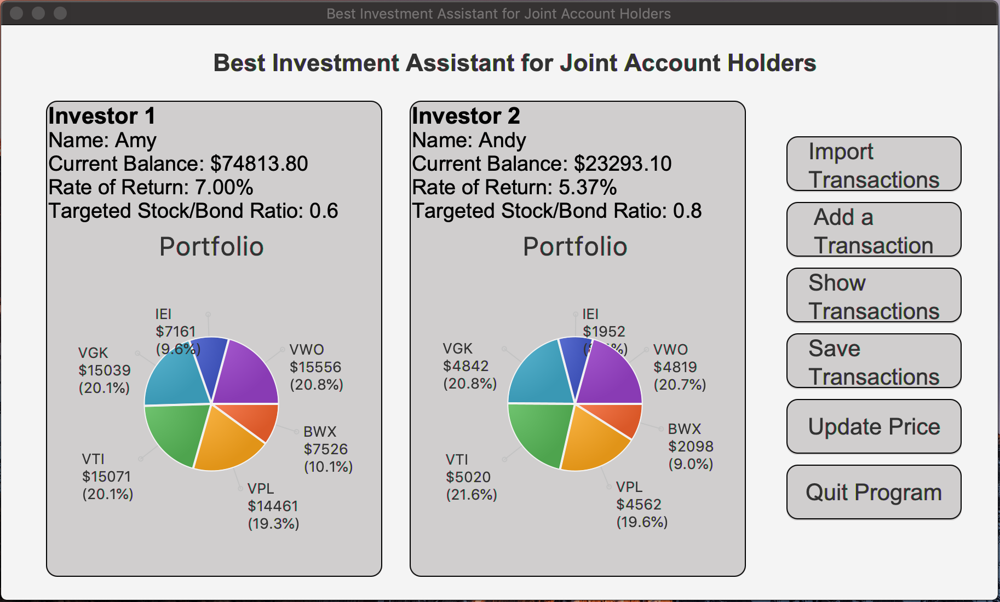

<!-- @import "[TOC]" {cmd="toc" depthFrom=1 depthTo=6 orderedList=false} -->

<!-- code_chunk_output -->

- [Best Investment Assistant for Joint Account Holders project](#best-investment-assistant-for-joint-account-holders-project)
  - [Project Name:](#project-name)
  - [Description:](#description)
  - [The GUI preview](#the-gui-preview)
  - [Directorie structure](#directorie-structure)
- [application](#application)
- [design proposal](#design-proposal)
- [screenshots](#screenshots)
- [data](#data)
- [output](#output)
- [manifest.txt](#manifesttxt)
- [executable.jar](#executablejar)
- [upload/](#upload)

<!-- /code_chunk_output -->

## Best Investment Assistant for Joint Account Holders project

### Project Name:

Best Investment Assistant for Joint Account Holders project

### Description:

Investment is a key to build up savings. Some investors use a joint investment account for various reasons like reducing account maintenance fee, fulfilling a minimum asset requirement. In such case, it is especially challenging for each individual to keep track of their assets because (1) each person’s investment target may overlap with one another, (2) different investors’ transactions on the same transaction target might have different unit cost, and (3) the dividends are given to the investors as a group rather than individually. Mainstream brokerage companies (e.g., Charles Schwab, TD Ameritrade) do not provide user interfaces for joint investors to view their individual investment records (e.g., current assets portfolio, change in assets).

With this program, the investors could readily (1) view their assets (e.g., current assets portfolio, return of investment, investment history), and (2) manage their investment accordingly (e.g., rebalancing).

### The GUI preview

### Directorie structure

* * *

## application

-   the package that could be opened by Eclipse and run to launch the program.
-   based on the design proposal:
    -   refer to googledrive/PhD program/UW-Madison/Courses/2020 Summer/CS 400/final project/a1

* * *

## design proposal

-   The design proposal for the program.
-   contain UML diagrams and GUI blueprints.

* * *

## screenshots

-   the screenshots of the program.
-   users could use this as a tutorial.

* * *

## data

-   the data read by the program.

* * *

## output

-   the data output by the program.

* * *

## manifest.txt

-   the file required for creating JAR file.
-   <https://canvas.wisc.edu/courses/202692/pages/create-a-java-archive-jar>

* * *

## executable.jar

-   created based on manifest.txt
-   <https://canvas.wisc.edu/courses/202692/pages/create-a-java-archive-jar>
-   commands:
    jar -cfm executable.jar manifest.txt .
    java --module-path "/Users/vimchiz/javafx-sdk-11.0.2/lib" --add-modules javafx.controls,javafx.fxml -jar executable.jar

* * *

## upload/

-   contains the files for assignment submission.
-   Note that the README files are tailored for submission purpose.
